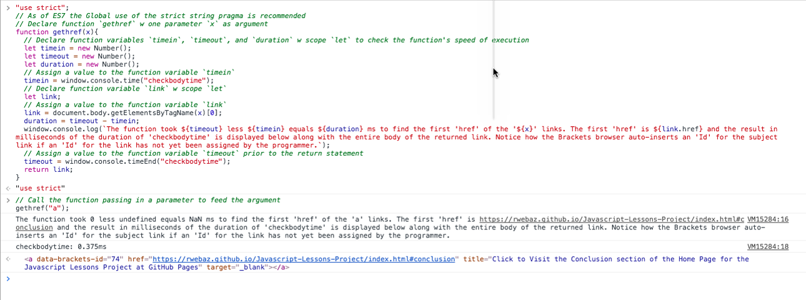

# {{ page.title }}

{{ page.excerpt }}



## By Class Name

More to come ...

```liquid

function getclass (x, y){
  let classes = document.body.getElementsByClassName(y);
  document.body.replaceChild(classes[x, y);
return classes.y
}
getclass("green-groove", "red-groove");

```

**Note**. In the above `getclass` function ...

- the DOM is traversed to find all instances of class `y`, and

- to replace all instances of class `y` found with class `x`.

Please remember the first argument of the function takes the parameter `x`.

The parameter `x` represents the `new` or replacing value.

Whereas, the parameter `y` represents the `old` or the value being replaced by `x`.

After traversing the DOM and capturing all of the old `y` class names, the function then replaces all of the old `y` class names with new `x` class name, and then returns the set of classes still of the old `y` class name of which there should now be none.

Further, the type of the variables `x` and `y`, as well as the `getclass` function will be instantiated and inferred at the time of function execution.

Therefore, there is no need to declare each variable individually, nor is there a need to assign a value to the variables.

The underlying Javascript engine will infer by the structure of the function, and by the type of parameters passed as arguments.

## By Tag Name

More to come ...

```liquid

function getpara (x, y, z){
  let paragraphs = document.body.getElementsByTagName(x);
  document.body.insertBefore(paragraphs[z], paragraphs[y]);
return paragraphs[0];
}
getpara("p", 2, 0);

```

**Note**. In the above `getpara` function ...

- the DOM is traversed to find all instances of `x`, where `x` represents the targeted *Tag Name* of "p", for paragraphs.

- Next, the program is instructed to *insert before* paragraph `y`, the paragraph `z`, where `z` represents the `index` paragraph.

The paragraph[0], commonly known as the *index* paragraph aka the *first* paragraph ...

- is placed, or inserted before the third paragraph [2] in the sequential series, or order of paragraphs discovered when traversing the DOM.

After traversing the DOM and capturing all of the `x` tag names of "p", the function then *inserts before* the `y` paragraph[2] ...

- the `z` paragraph[0], and

- then returns the *new* paragraph[0].

As a result of the function, in this case ...

- The *old* `z` paragraph[0] is now holding the second position in the array-like list of paragraphs traversed, as the now paragraph[1] ...

- With the `y` paragraph[2] now holding the same third position, and

- the *old* second paragraph[1] now filling the *new* index position of paragraph[0].

Therefore, the program should return the value of the the *old* second paragraph[1] now become the *index* paragraph[0].

### Get First Link

An exercise designed to capture the first anchor link of an html page through the Javascript method `getElementsByTagName()` using the Javascript console of the Chrome browser and the Chrome Developer Toolset, or CDT.

This exercise has successfully yielded the following (.png) and (.log) files, as follows:



- [Get First Link Log](../assets/logs/get-first-link.log){:target='_blank'}

```liquid

function gethref(x){
  // Declare function variables `timein`, `timeout`, and `duration` w scope `let` to check the function's speed of execution
  let timein = new Number();
  let timeout = new Number();
  let duration = new Number();
  // Assign a value to the function variable `timein`
  timein = window.console.time("checkbodytime");
  // Declare function variable `link` w scope `let` 
  let link;
  // Assign a value to the function variable `link`
  link = document.body.getElementsByTagName(x)[0];
  duration = timeout - timein;
  window.console.log(`The function took ${timeout} less ${timein} equals ${duration} ms to find the first 'href' of the '${x}' links. The first 'href' is ${link.href} and the result in milliseconds of the duration of 'checkbodytime' is displayed below along with the entire body of the returned link. Notice how the Brackets browser auto-inserts an 'Id' for the subject link if an 'Id' for the link has not yet been assigned by the programmer.`);
  // Assign a value to the function variable `timeout` prior to the return statement
  timeout = window.console.timeEnd("checkbodytime");
  return link;
}
// Call the function passing in a parameter to feed the argument
gethref("a");

```

**Note**. In the above `gethref` function ...

- the DOM is traversed to find the single [0] instance of `x`, where `x` represents the targeted *Tag Name* of "a", for anchors.

- Next, the program is instructed to display the `link.href` of the discovered [0] instance and return the entire `link`.

- Along the way, the speed of function execution is timed, as well.

## Other Methods

```liquid

// document.body.appendChild();

```

And,

```liquid

// document.body.insertBefore();

```

## Last Subtitle

**Note**. The above synopsis was derived from an article written by Blank [[2](#BLANK){:.red}].

### Raw Code Block

```liquid

Enjoy the successful output!

```





### External Sources

- The [Project Source Links](https://mminail.github.io/Javascript/Source-Javascript-Links.htm){:title='Click to Visit the Source Links page of the Javascript Lessons Project at GitHub pages'}{:target='_blank'} page of the Javascript Lessons Project. Published by © 2017 - 2018 [Mminail.github.io](https://mminail.github.io/){:title='Click to Visit the Home Page of the Concept Library at the Medical Marijuana Initiative of North America - International Limited, an Arizona Benefit Corporation'}{:target='_blank'}.

**Note**. This page crafted with {{ page.version }}.
